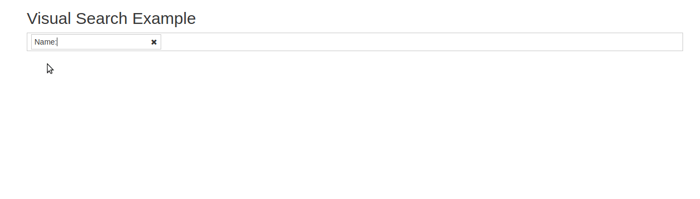

# React_Visual_Search
 React Basic Visual Search Library.


## Quick Overview
`react_visual_search` allows to search data by attribute name.
Multiple filters can be applied to take broad range of data.

# Features:
* Search Support text,list and date mode.


## Examples


## Getting started

```sh
npm install react_visual_search
Or
git clone https://github.com/NikunjPansuriya/React_Visual_Search.git
cd visual_search/

npm install
npm start
```

Then open [http://localhost:8080/](http://localhost:8080/) to see demo examples.


## Quick Usage :
* Add style in Your Application.
```sh
import 'react_visual_search/libs/css/visual_search.css';
```
* Add Visual_Search in Your Application.

```sh

import VisualSearch from 'react_visual_search';
..
...
onFilter(filters){
 console.log(filters);
}

render(){
  return (
    <VisualSearch
      className= "react_visual_search"
      category= {[
        {label: "Name",name:"name",type: "text"},
        {label: "First Name",name:"firstName",type: "text"},
        {label: "Gender", name:"gender",type:"list",options:[{label:"Male",value:"M"},{label:"Female",value:"F"}]},
        {label: "Date of Birth", name:"birthDate",type: "date", options:{format:"DD-MMM-YYYY",mode:"days"}}
      ]}
      onFilter= {this.onFilter}
    />
  );
}
....
...

```

## Supported Types :
* `text`
* `list`
* `date`
  * format: It accepts any [http://momentjs.com/docs/#/displaying/format/](Moment.js) date format.
  * mode: The default view to display when the picker is shown ('days','month','year').

## License
MIT.
